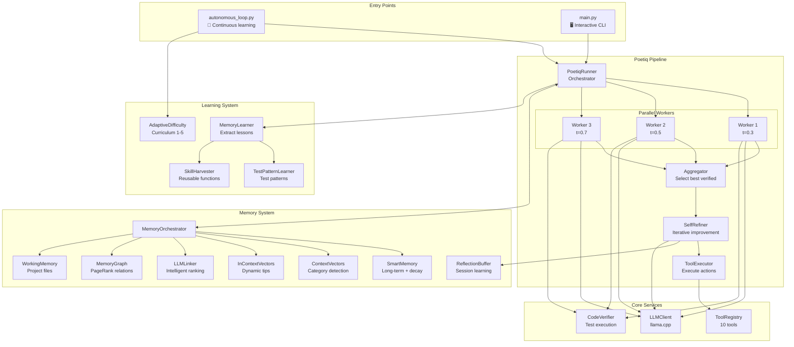

# 🔬 Architecture Evolution & Technical Deep Dive

> **Current State**: Fully functional autonomous self-improving agent  
> **Last Updated**: 10 Dec 2025

---

## 📊 System Metrics

| Metric | Value |
|--------|-------|
| Total Modules | 35+ |
| Memory Subsystems | 7 |
| Available Tools | 10 |
| LLM Calls (optimized) | 6-15 per task |
| Parallel Workers | 3 |

---

## 🏗️ Complete Architecture Diagram



---

## 🧠 Memory Subsystems

### 1. SmartMemory (`memory/base.py`)
**Inspired by A-Mem (Agentic Memory)**

```python
Memory = {
    "id": "uuid",
    "lesson": "Always use try/except for file operations",
    "category": "file_create",
    "importance": 8,        # 1-10 scale
    "access_count": 12,
    "success_count": 10,    # How many times it helped
    "failure_count": 2,     # How many times it didn't
    "keywords": ["file", "error", "exception"],
    "links": {"mem_xyz": 0.8, "mem_abc": 0.5},  # Weighted links
    "created_at": "2024-12-10T10:00:00",
    "last_accessed": "2024-12-10T19:00:00"
}
```

**Features:**
- **Temporal decay**: Memories fade by 0.98/day if not accessed
- **Importance scoring**: Critical lessons (8-10) persist longer
- **Success tracking**: Learns which advice works
- **Weighted links**: Related memories connected with strength weights

---

### 2. ContextVectors (`memory/context_vectors.py`)
**Category Detection Engine**

```python
FUNCTION_VECTORS = {
    "file_create": {
        "keywords": ["crear", "create", "write", "archivo", "file", "save"],
        "tools": ["write_file", "python_exec"]
    },
    "code_exec": {
        "keywords": ["ejecutar", "run", "python", "execute", "code"],
        "tools": ["python_exec"]
    },
    # ... more categories
}
```

**How it works:**
1. Query comes in: "create a file with hello world"
2. Match keywords: "create", "file" → `file_create` category (confidence: 0.85)
3. Suggest tools: `write_file`, `python_exec`
4. Fetch category-specific ICV tips

---

### 3. InContextVectors (`memory/context_vectors.py`)
**Dynamic Prompt Tips**

```python
ICV_TIPS = {
    "file_create": "Verify the file exists after creation. Use absolute paths.",
    "code_exec": "Include error handling. Test with edge cases. Print results.",
    "analysis": "Break down the problem. Consider multiple approaches."
}
```

These tips are injected into the system prompt based on detected category.

---

### 4. MemoryGraph (`memory/graph.py`)
**NetworkX Knowledge Graph**

```python
# Nodes: Memory IDs
# Edges: Weighted relationships (0.0 - 1.0)

graph = MemoryGraph()
graph.add_memory("mem_1", keywords=["error", "handling"])
graph.add_memory("mem_2", keywords=["try", "except"])
graph.create_link("mem_1", "mem_2", weight=0.8)

# Uses PageRank to identify central memories
central = graph.get_most_connected()  # ["mem_2", "mem_1", ...]

# Strengthen when co-retrieved
graph.strengthen_link("mem_1", "mem_2")  # weight → 0.88

# Weaken on contradiction
graph.weaken_link("mem_1", "mem_2")  # weight → 0.72
```

---

### 5. WorkingMemory (`memory/working_memory.py`)
**Project-Specific Context**

Uses ChromaDB to index and search project files:

```python
working_mem = WorkingMemory()
working_mem.index_workspace("./my_project")  # Indexes .py, .md, .json, etc.

# Smart chunking for Python files:
# - Functions become individual chunks
# - Classes become separate chunks
# - Preserves docstrings and signatures

results = working_mem.search("database connection")
# Returns: [{"content": "def connect_db(...)...", "file": "db.py"}, ...]
```

---

### 6. SkillHarvester (`memory/skill_harvester.py`)
**DreamCoder-Inspired Function Library**

When code is verified successfully:
1. AST parse to extract function definitions
2. Filter: must have docstring or descriptive name
3. Save to `data/skills/skill_001.py`
4. Index in `skills_index.json` with metadata

```python
# skills/skill_fibonacci.py
def fibonacci(n: int) -> int:
    """Calculate the n-th Fibonacci number."""
    if n <= 1:
        return n
    return fibonacci(n - 1) + fibonacci(n - 2)
```

Skills are injected into prompts as "Available helper functions".

---

### 7. ReflectionBuffer (`memory/reflection_buffer.py`)
**Intra-Session Error Avoidance**

```python
buffer = ReflectionBuffer()

# After a failed iteration:
buffer.add_reflection(
    error_type="IndexError",
    error_summary="list index out of range",
    lesson="Check list length before accessing indices"
)

# Before next iteration:
reflections = buffer.get_relevant("access list element")
# Returns: ["Check list length before accessing indices"]
```

**Auto-generated lessons** for common errors:
- `SyntaxError` → "Check for missing colons, parentheses, or indentation"
- `NameError` → "Ensure variable is defined before use"
- `TypeError` → "Verify argument types match function signature"

---

## ⚡ Poetiq Pipeline Phases

### Phase 1: Memory Context Retrieval
```
Query: "Create a function to validate emails"
          │
          ▼
    ┌─────────────────────────────────────┐
    │       MemoryOrchestrator            │
    │  ┌────────────┐  ┌───────────────┐  │
    │  │ContextVecs │  │ SmartMemory   │  │
    │  │ category:  │  │ 3 memories:   │  │
    │  │ "code_exec"│  │ - validation  │  │
    │  │ confidence:│  │ - regex tips  │  │
    │  │ 0.85       │  │ - email parse │  │
    │  └────────────┘  └───────────────┘  │
    │  ┌────────────┐  ┌───────────────┐  │
    │  │ ICV Tips   │  │ WorkingMemory │  │
    │  │ "Test edge │  │ (project      │  │
    │  │  cases..." │  │  context)     │  │
    │  └────────────┘  └───────────────┘  │
    └─────────────────────────────────────┘
          │
          ▼
    MemoryContext {
        category: "code_exec",
        memories: [...],
        tips: "...",
        tools_suggested: ["python_exec"]
    }
```

### Phase 2: Parallel Worker Execution
```
MemoryContext + Query
          │
    ┌─────┴─────┐
    ▼     ▼     ▼
  ┌───┐ ┌───┐ ┌───┐
  │W1 │ │W2 │ │W3 │  Temperature variance: 0.3, 0.5, 0.7
  │t=3│ │t=5│ │t=7│
  └─┬─┘ └─┬─┘ └─┬─┘
    │     │     │
    ▼     ▼     ▼
  [Generate Code]     # 1 LLM call each
    │     │     │
    ▼     ▼     ▼
  [Extract solve()]
    │     │     │
    ▼     ▼     ▼
  [Execute against test cases]
    │     │     │
    ▼     ▼     ▼
  verified=True/False

Workers that fail verification can retry (up to 2 times).
```

### Phase 3: Aggregation
```
Worker Results:
  W1: verified=True,  score=20, code="..."
  W2: verified=False, score=12, code="..."
  W3: verified=True,  score=18, code="..."
          │
          ▼
    ┌─────────────────────────────────────┐
    │           Aggregator                │
    │                                     │
    │ Priority:                           │
    │ 1. verified=True workers first      │
    │ 2. Sort by score descending         │
    │ 3. Select top response              │
    │                                     │
    │ If ALL verified && top score >= 15: │
    │   → SKIP Pre-Evaluation ✅          │
    └─────────────────────────────────────┘
          │
          ▼
    Best Response (W1, score=20, verified=True)
```

### Phase 4: Self-Refine Loop
```
Best Response
          │
    ┌─────┴─────────────────────────────────┐
    │           SelfRefiner                  │
    │                                        │
    │   ┌───────────┐                        │
    │   │ Evaluate  │ ← 1 LLM call           │
    │   │ score: 20 │                        │
    │   └─────┬─────┘                        │
    │         │                              │
    │    score >= 18?                        │
    │    ┌────┴────┐                         │
    │   YES       NO                         │
    │    │         │                         │
    │    ▼         ▼                         │
    │  DONE    ┌───────────┐                 │
    │          │  Refine   │ ← 1 LLM call    │
    │          │(1 worker) │   (optimized)   │
    │          └─────┬─────┘                 │
    │                │                       │
    │           Re-evaluate                  │
    │           (max 3 iterations)           │
    └────────────────────────────────────────┘
```

---

## 📈 Optimizations Implemented

### 1. Skip Pre-Evaluation (~1 LLM call saved)
```python
# In runner.py
if all_workers_verified and best_score >= 15:
    skip_pre_eval = True  # Don't waste LLM call
```

### 2. Single Worker for Refine (~2 LLM calls saved)
```python
# In refiner.py
# Before: Spawned 3 workers for each refinement
# After: Single worker at t=0.3 for focused refinement
```

### 3. Skip Lesson Extraction (~1 LLM call saved)
```python
# In runner.py
if final_score >= 20 and was_verified:
    skip_lesson_extraction = True  # Already good, no lesson needed
```

### 4. Centralized Context Limits
```python
# In settings.py
CONTEXT_LIMITS = {
    "memory_preview": 200,
    "reflection_preview": 150,
    "error_summary": 100,
    # ... all truncation limits in one place
}
```

---

## 📋 Configuration Reference

All settings in `config/settings.py`:

```python
# === LLM ===
LLM_BASE_URL = "http://127.0.0.1:8080/v1"
LLM_MAX_TOKENS = 2048
LLM_TEMPERATURE = 0.3

# === Workers ===
POETIQ_NUM_WORKERS = 3
WORKER_TEMPS = [0.3, 0.5, 0.7]
WORKER_MAX_VERIFY_RETRIES = 2

# === Self-Refine ===
REFINE_MAX_ITERATIONS = 3
REFINE_THRESHOLD = 18
REFINE_EARLY_STOP_THRESHOLD = 22

# === Memory ===
MEMORY_DECAY_FACTOR = 0.98
MEMORY_MAX_IMPORTANCE = 10
TOP_K_MEMORIES = 5
LLM_LINKING_THRESHOLD = 10

# === Learning ===
LESSON_BATCH_SIZE = 5
SKIP_LESSON_THRESHOLD = 20

# === Autonomous Loop ===
AUTONOMOUS_CHECKPOINT_INTERVAL = 10
AUTONOMOUS_HEALTH_CHECK_INTERVAL = 5
MAX_CONSECUTIVE_FAILURES = 3
```

---

## 🔄 Historical Evolution

### Phase 1: Basic Agent ✅
- Single-threaded LLM calls
- No memory system
- Manual task input only

### Phase 2: Poetiq Pipeline ✅
- Parallel workers with varied temperatures
- Aggregation of best responses
- Self-refine loop

### Phase 3: Memory System ✅
- SmartMemory with decay
- ContextVectors for category detection
- LLMLinker for ranking
- MemoryGraph with PageRank

### Phase 4: Learning System ✅
- SkillHarvester (DreamCoder-inspired)
- TestPatternLearner
- ReflectionBuffer
- AdaptiveDifficulty (curriculum learning)

### Phase 5: Optimizations ✅
- Skip unnecessary LLM calls
- Centralized settings
- Truncation limits
- Single-worker refinement

---

## 🔮 Future Roadmap

### Near Term
- [ ] Error Translation Layer (tracebacks → semantic instructions)
- [ ] Proactive Memory Navigation (graph traversal before generation)
- [ ] Move remaining hardcoded values to settings

### Medium Term
- [ ] Specialized Worker Roles (Architect, Coder, Reviewer)
- [ ] Tree of Thoughts for complex problems
- [ ] WorkingMemory timestamp-based incremental indexing

### Long Term
- [ ] Multi-agent collaboration
- [ ] External tool integration (web search, databases)
- [ ] Self-modifying code capabilities

---

## 📊 Performance Benchmarks

| Metric | Before Optimization | After Optimization |
|--------|--------------------|--------------------|
| LLM Calls (avg) | ~25-30 | ~8-12 |
| Time per Task | ~45s | ~20s |
| Memory Usage | Unbounded | Capped with decay |
| Lesson Quality | All extracted | Smart filtering |

---

*Document maintained by the Self-Refine CLI system.*
