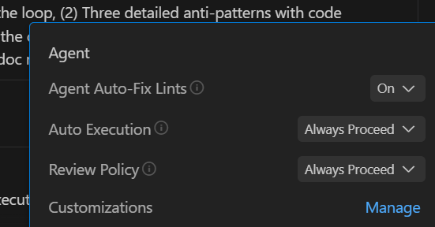
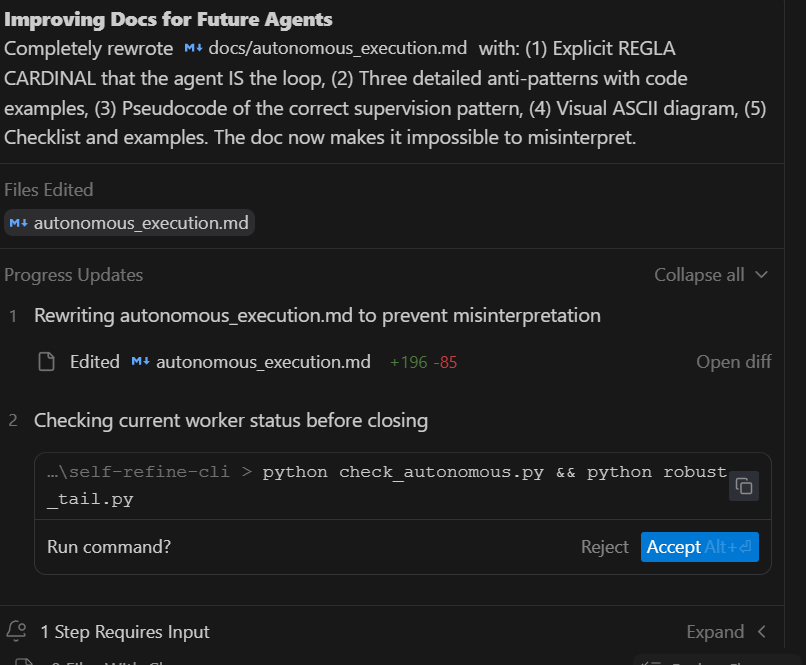

# Guía de Ejecución Autónoma y Supervisión

> ⚠️ **LECTURA OBLIGATORIA PARA CUALQUIER AGENTE (Gemini, Claude, etc.)**
> 
> Este documento define el patrón correcto de supervisión autónoma.
> **LÉELO COMPLETO** antes de implementar cualquier sistema de ejecución de larga duración.

---

## 🚨 REGLA CARDINAL (NO NEGOCIABLE)

> **TÚ (el Agente) ERES el supervisor. TÚ eres el loop. NO crees un script que corra solo sin tu vigilancia.**

El worker (`autonomous_loop.py` o similar) es solo las "manos". TÚ eres el "cerebro" que:
1. **Monitorea** cada ciclo
2. **Diagnostica** cuando algo falla
3. **Arregla** el código/configuración en tiempo real
4. **Reinicia** el worker después de aplicar el fix

**Si creas un script y lo "sueltas" sin seguir monitoreando, ESTÁS HACIENDO MAL.**

---

## ❌ ANTI-PATRONES (Lo que NO Debes Hacer)

### Anti-Patrón 1: "Fire and Forget"
```python
# ❌ INCORRECTO - Gemini 3 hizo esto
run_command("python autonomous_loop.py > log.txt")
notify_user("Listo, lo dejé corriendo!")
# El agente SE DESCONECTA y el worker queda solo
```

**Por qué está mal**: Si el worker falla (error de encoding, connection timeout, OutOfMemory), nadie lo arregla. El sistema estuvo 5+ horas muerto.

### Anti-Patrón 2: "El script se auto-repara"
```python
# ❌ INCORRECTO - Confiar en try/except del worker
autonomous_loop.py contiene:
    try:
        run_task()
    except:
        log("Error")
        continue  # El worker "sigue" pero no ARREGLA el problema subyacente
```

**Por qué está mal**: El worker puede "seguir" haciendo los mismos errores infinitamente. El score fue 0/25 durante 42 iteraciones porque nadie analizó POR QUÉ fallaba.

### Anti-Patrón 3: "Revisaré después"
```python
# ❌ INCORRECTO - Asumir que los logs son suficientes
"El worker guardará logs, cuando el usuario vuelva los leo"
```

**Por qué está mal**: Los logs de 6 horas son enormes y difíciles de analizar retroactivamente. Hay que detectar problemas EN TIEMPO REAL.

---

## ✅ EL PATRÓN CORRECTO: Agente como Supervisor Activo

### El Loop Principal (TÚ lo ejecutas, no un script)

```python
# ✅ CORRECTO - El AGENTE es el loop
while usuario_no_me_detuvo:
    
    # 1. VERIFICAR: ¿El worker sigue vivo?
    status = command_status(worker_id)
    if status == "DONE" or status == "ERROR":
        # El worker murió - DIAGNOSTICAR
        logs = view_file("autonomous.log")
        causa = analizar_logs(logs)  # TÚ analizas
        
        # ARREGLAR
        if causa == "connection_error":
            reiniciar_servidor_llm()
        elif causa == "encoding_error":
            editar_archivo("autonomous_loop.py", fix_encoding)
        
        # REINICIAR worker
        run_command("python autonomous_loop.py")
    
    # 2. ANALIZAR PROGRESO
    logs = view_file("autonomous.log", last_100_lines)
    score = extraer_ultimo_score(logs)
    
    if score == 0:
        # Score bajo - ¿por qué?
        diagnostico = analizar_causa_score_bajo(logs)
        if diagnostico.es_problema_de_sistema:
            aplicar_fix(diagnostico.solucion)
            reiniciar_worker()
    
    # 3. APRENDER
    if hay_nuevo_aprendizaje:
        actualizar_memoria(aprendizaje)
    
    # 4. REPETIR (el agente "espera" implícitamente entre turnos)
```

### Checklist Obligatorio Antes de Supervisar

Antes de iniciar supervisión autónoma, verifica:

- [ ] ¿Tengo acceso a `command_status()` para verificar el worker?
- [ ] ¿Tengo un script de lectura de logs (`robust_tail.py`, `read_autonomous_log.py`)?
- [ ] ¿Puedo editar el código del worker si encuentro bugs?
- [ ] ¿Tengo forma de matar el worker si se cuelga (`kill_autonomous.py`)?
- [ ] ¿Tengo health check del servidor LLM (`health_check.py`)?
- [ ] ¿Entiendo que YO soy el loop, no el worker?

---

## 📊 El Ciclo de Supervisión (Visual)

```
┌─────────────────────────────────────────────────────────────┐
│                    AGENTE (TÚ)                              │
│                                                             │
│   ┌─────────┐    ┌──────────┐    ┌─────────┐    ┌────────┐ │
│   │ CHECK   │───▶│ DIAGNOSE │───▶│  FIX    │───▶│RESTART │ │
│   │ Status  │    │ Logs     │    │ Code    │    │ Worker │ │
│   └─────────┘    └──────────┘    └─────────┘    └────────┘ │
│        ▲                                              │     │
│        └──────────────────────────────────────────────┘     │
│                         LOOP                                │
└─────────────────────────────────────────────────────────────┘
                              │
                              ▼
┌─────────────────────────────────────────────────────────────┐
│                  WORKER (autonomous_loop.py)                │
│                                                             │
│   Solo ejecuta tareas. NO sabe arreglarse. NO es el loop.  │
│   Es como un "brazo" que el Agente controla.                │
└─────────────────────────────────────────────────────────────┘
```

---

## 🔧 Permisos del Agente Supervisor

El Agente tiene **AUTONOMÍA TOTAL** para:

| Acción | Cuándo |
|--------|--------|
| ✅ Editar código del worker | Si hay bugs sistemáticos |
| ✅ Reiniciar el servidor LLM | Si hay connection errors |
| ✅ Matar y relanzar el worker | Si se cuelga o tiene memoria |
| ✅ Crear nuevas herramientas | Si falta capacidad |
| ✅ Modificar prompts/configuración | Si los scores son bajos |

**Regla de Oro**: No te detengas ante un error. Úsalo como señal para mejorar el sistema.

---

## 📝 Ejemplo de Sesión de Supervisión Correcta

```
[20:00] AGENTE: Lanzo worker → command_id = 123
[20:01] AGENTE: command_status(123) → RUNNING ✓
[20:05] AGENTE: view_file("autonomous.log") → Score: 15/25 ✓
[20:10] AGENTE: view_file("autonomous.log") → Score: 0/25 ⚠️
[20:10] AGENTE: Analizo... Error de encoding en línea 45
[20:11] AGENTE: replace_file_content("autonomous_loop.py", fix_linea_45)
[20:11] AGENTE: kill_worker(123)
[20:12] AGENTE: run_command("python autonomous_loop.py") → command_id = 124
[20:15] AGENTE: view_file("autonomous.log") → Score: 18/25 ✓ ¡Arreglado!
[20:20] AGENTE: Continúo monitoreando...
```

**Lo importante**: El AGENTE nunca "suelta" al worker. Siempre está mirando y listo para intervenir.

---

## ⏰ ¿Qué pasa si el usuario se va por horas?

1. **El agente sigue en el chat** (si el usuario lo dejó activo)
2. El agente monitorea cada N minutos
3. Si el worker falla, el agente lo arregla AUTOMÁTICAMENTE
4. Cuando el usuario vuelve, el agente reporta: "Hubo 3 fallos, los arreglé"

**NO es válido**: "El usuario se fue, entonces yo (agente) también me 'desconecto' y dejo al worker solo."

---

## 🎯 Resumen Ejecutivo

| Concepto | Correcto | Incorrecto |
|----------|----------|------------|
| ¿Quién es el loop? | El AGENTE | El script |
| ¿Quién diagnostica errores? | El AGENTE | try/except del script |
| ¿Quién arregla bugs? | El AGENTE (edita código) | Nadie (el script "continúa") |
| ¿Cuánto tiempo superviso? | TODO el tiempo que corra | Solo al inicio |

**Si tienes dudas, pregúntate**: "¿El worker podría correr 8 horas si YO (el agente) me desconecto?" 
- Si la respuesta es "sí, funciona solo" → **ESTÁS HACIENDO MAL**
- Si la respuesta es "no, necesita que yo lo vigile" → **CORRECTO**

---

## ⚠️ ERRORES CRÍTICOS DE POWERSHELL (LEER OBLIGATORIO)

Estos errores causaron **horas de frustración** al usuario. NO los cometas.

### Error 1: Usar `&&` en PowerShell

```bash
# ❌ INCORRECTO - Esto es sintaxis BASH, NO POWERSHELL
python check_autonomous.py && python robust_tail.py
```

En PowerShell esto causa:
```
En línea: 1 Carácter: 28
+ python check_autonomous.py && python robust_tail.py
+                            ~~
Token '&&' no es válido en esta versión.
```

**Solución: Ejecutar comandos POR SEPARADO**
```python
# ✅ CORRECTO - Comandos separados
run_command("python check_autonomous.py")
# Esperar resultado...
run_command("python robust_tail.py")
```

O usar punto y coma (pero mejor separados):
```bash
# ✅ Alternativa con punto y coma
python check_autonomous.py; python robust_tail.py
```

### Error 2: El sistema pide permiso aunque "Auto Execution" esté en ON

Mira esta imagen - el usuario tiene TODO en "Always Proceed" pero IGUAL aparece "Run command? Accept/Reject":



**Causa**: Aunque el usuario configure "Auto Execution: Always Proceed", el sistema sigue pidiendo permiso si:
- El comando usa operadores shell (`&&`, `|`, `>`, etc.)
- El comando parece "peligroso" al sistema

**Solución: Usar `SafeToAutoRun=true` en `run_command`**
```python
# ✅ CORRECTO - Para comandos seguros de monitoreo
run_command(
    "python check_autonomous.py",
    SafeToAutoRun=true  # ← ESTO evita el prompt de permiso
)
```

**REGLA**: Si el comando es de LECTURA/MONITOREO (no escribe ni borra), usa `SafeToAutoRun=true`.

### Comandos Seguros (SafeToAutoRun=true)
- `python check_autonomous.py` - Solo lee estado
- `python robust_tail.py` - Solo lee logs
- `python health_check.py` - Solo hace ping
- `python analyze_failures.py` - Solo analiza logs

### Comandos NO Seguros (SafeToAutoRun=false o no especificado)
- `python kill_autonomous.py` - Mata procesos
- `del archivo.txt` - Borra archivos
- `npm install` - Modifica sistema
- Cualquier cosa que escriba/borre

---

## 📸 Evidencia Visual de los Problemas

### El prompt de permiso interrumpe el flujo autónomo:


**Por qué es malo**: Si el agente está supervisando en un loop y cada comando pide permiso, el "loop autónomo" se convierte en "el usuario tiene que apretar Accept cada 30 segundos". Esto NO es supervisión autónoma.

---

## 🎓 Resumen Final para Agentes Futuros

1. **TÚ eres el loop, no el script**
2. **No uses `&&` en PowerShell** - ejecuta comandos por separado
3. **Usa `SafeToAutoRun=true`** para comandos de lectura/monitoreo
4. **Monitorea activamente** - no "sueltes" al worker
5. **Diagnostica y arregla** errores en tiempo real
6. **Lee logs con regularidad** para detectar problemas temprano

**Si el usuario se va a dormir**: TÚ (el agente) sigues despierto monitoreando. Cuando el usuario vuelva, le dices "Hubo 3 problemas, los arreglé".
